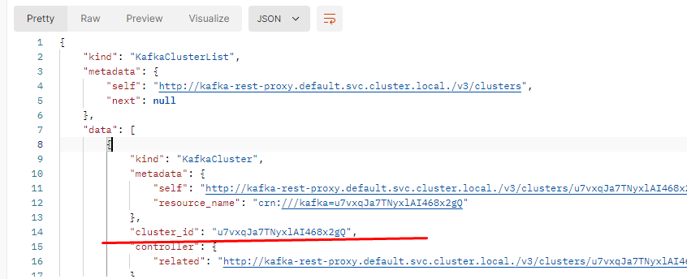

# Базовая настройка

## Запуск minikube

[Инструкция по установке](https://minikube.sigs.k8s.io/docs/start/)

```bash
minikube start
```

## Установка helm 

https://helm.sh/

## Запуск 
 
Перейти в директорию charts

```bash
helm install smart-home ./smart-home
```

## Установка API GW kusk

[Install Kusk CLI](https://docs.kusk.io/getting-started/install-kusk-cli)

```bash
kusk cluster install
```

## Настройка API GW

Перейти в директорию gateway

Куск не поддерживает 
```bash
kusk deploy -i kafka-proxy-api.yaml
```

Прокинуть порт гейтвея 

```bash
kubectl port-forward svc/kusk-gateway-envoy-fleet -n kusk-system 8080:80
```

Получить информацию кластера

```bash
curl --location 'http://localhost:8080/v3/clusters'
```

Для дальнейших запросов необходим id кластера


Посмотреть топики
```bash
curl --location 'http://localhost:8080/v3/clusters/<ID cluster>/topics'
```

Создать топик если не создался 

```bash
curl --location 'http://localhost:8080/v3/clusters/<ID cluster>/topics' \
--header 'Content-Type: application/json' \
--data '{"topic_name":"telemetry-data-topic"}'
```

Создать сообщение 
```bash
curl --location 'http://localhost:8080/v3/clusters/7vxqJa7TNyxlAI468x2gQ/topics/telemetry-data-topic/records' \
--header 'Content-Type: application/json' \
--data '{
  "value": {
    "type": "JSON",
    "data": {
      "timestamp": "2024-08-29T12:34:56Z",
      "deviceId": "b1e0bfc4-79c3-49a1-8df4-e6e8b8471d9a",
      "data": {
        "temperature": 22.5,
        "humidity": 60,
        "status": "ok"
      }
    }
  }
}
'
```

Проверим данные в монго

Не разобрался как в куск подгрузить несколько файлов с апи
```bash
 kusk deploy -i .\api-device.yaml
```

```bash
curl --location 'http://localhost:8080/device-service/api/v1/devices/<ID device который отправили на предыдущем запросе>/telemetry/latest' \
--header 'Accept: application/json'
```


## Delete minikube

```bash
minikube delete
```
