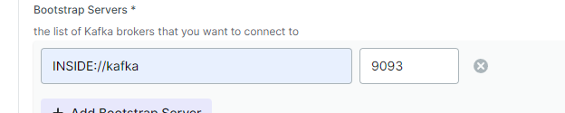

# Базовая настройка

## Запуск minikube

[Инструкция по установке](https://minikube.sigs.k8s.io/docs/start/)

```bash
minikube start
```

## Установка helm 

https://helm.sh/

## Запуск 

```bash
helm install smart-home ./smart-home
```

## Установка API GW kusk

[Install Kusk CLI](https://docs.kusk.io/getting-started/install-kusk-cli)

```bash
kusk cluster install
```

## Настройка API GW

```bash
kusk deploy -i api.yaml
```

## Проверяем работоспособность

```bash
kubectl port-forward svc/kusk-gateway-envoy-fleet -n kusk-system 8080:80
curl localhost:8080/hello
```

## Delete minikube

```bash
minikube delete
```


Локальная проверка без gateway

пробрасываем порт ui приложения kafka-ui

```bash
kubectl get pods -l app=kafka-ui
```

```bash
kubectl port-forward <pod-name> 8080:8080
```
http://localhost:8080/ui/clusters/create-new-cluster

Проверить отправку и прием сообщений можно утилитой по адресу localhost:8085



В теле сообщения в топик отправить

```json
{
  "timestamp": "2024-08-22T20:00:00Z",
  "deviceId": "123e4567-e89b-12d3-a456-426614174000",
  "data": {
    "temperature": 22.5,
    "humidity": 60
  }
}