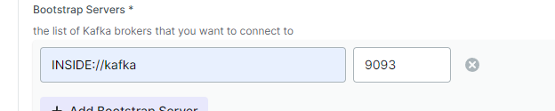
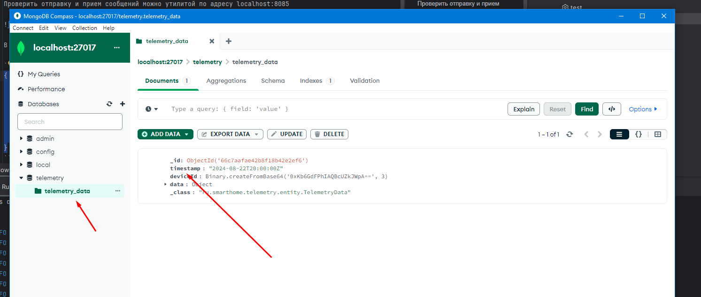

## Запуск в minikube

Установите minikube https://kubernetes.io/ru/docs/tasks/tools/install-minikube/

```bash
minikube start
```

Установите helm https://helm.sh/

```bash
helm install smart-home ./smart-home
```
Подождать 2 минуты после запуска

Проверить отправку и прием сообщений можно утилитой по адресу localhost:8085



В теле сообщения в топик отправить 

```json
{
  "timestamp": "2024-08-22T20:00:00Z",
  "deviceId": "123e4567-e89b-12d3-a456-426614174000",
  "data": {
    "temperature": 22.5,
    "humidity": 60
  }
}
```

Ключ сообщения любой

Проверить доставку в device-service и дальнейшую отправку в telemetry-service с сохранением в mongo можно в компасе



